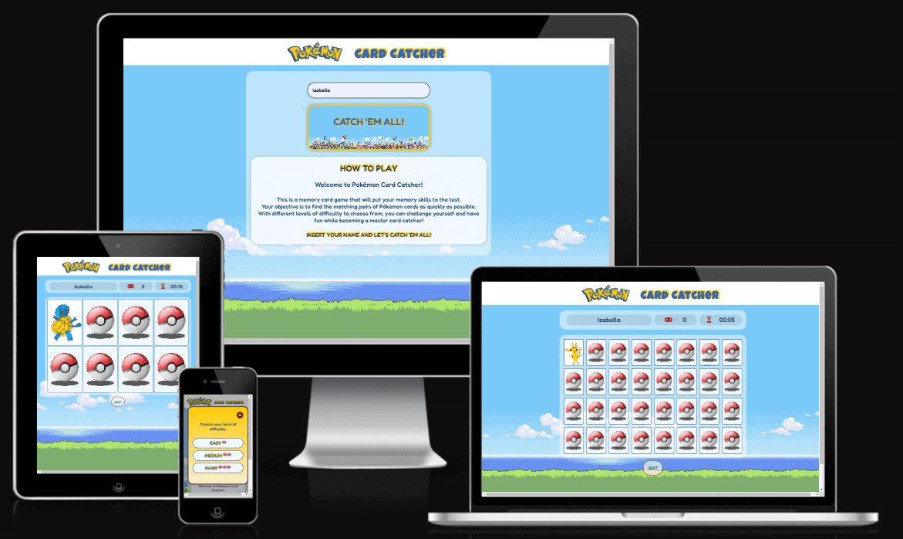
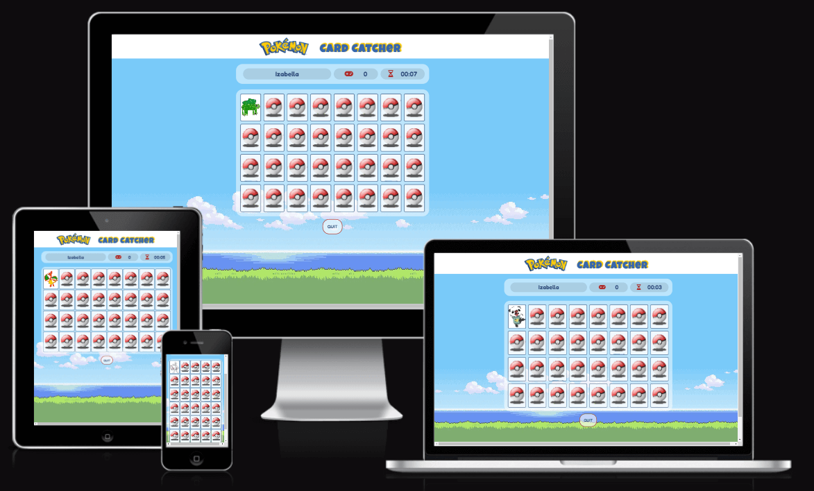

# Pokémon Card Catcher - Memory Card Game

Visit the deployed site: [Pókemon Card Catcher](https://izabellalopes.github.io/pokemon-card-catcher/)

Welcome to Pokémon Card Catcher, the ultimate memory card game that will put your memory skills to the test! Whether you're a seasoned Pokémon fan or just looking for a fun and challenging game, this is the perfect choice for you.

Pokémon Card Catcher was developed for players of all ages who enjoy testing their memory and concentration abilities while immersed in the colorful world of Pokémon. The game's concept is simple but addictive: find matching pairs of Pokémon cards as quickly as possible.

The game board features a grid of facedown cards, and your task is to flip them over two at a time, aiming to reveal cards with identical Pokémon. As you uncover the cards, try to remember their positions to make successful matches.

One unique aspect of Pokémon Card Catcher is that the captivating images of the Pokémon were drawn by my talented children. Their artwork adds a personal touch to the game, making it even more special and enjoyable for players of all ages.

Embark on this delightful Pokémon memory adventure and see if you have what it takes to catch 'em all in Pokémon Card Catcher!

## CONTENTS

- [User Experience](#user-experience-ux)

  - [User Stories](#user-stories)

- [Design](#design)

  - [Color Scheme](#color-scheme)
  - [Typography](#typography)
  - [Imagery](#imagery)
  - [Wireframes](#wireframes)
  - [Features](#features)
    - [The Home Page](#the-home-page)
    - [The Game Page](#the-game-page)
    - [The 404 Error Page](#the-404-error-page)
    - [Future Implementations](#future-implementations)
  - [Accessibility](#accessibility)

- [Technologies Used](#technologies-used)

  - [Languages Used](#languages-used)
  - [Frameworks, Libraries & Programs Used](#frameworks-libraries--programs-used)

- [Deployment & Local Development](#deployment--local-development)

  - [Deployment](#deployment)
  - [Local Development](#local-development)
    - [How to Fork](#how-to-fork)
    - [How to Clone](#how-to-clone)

- [Testing](#testing)
  - [Solved Bugs](#solved-bugs)
  - [Known Bugs](#known-bugs)
- [Credits](#credits)
  - [Code Used](#code-used)
  - [Content](#content)
  - [Media](#media)
  - [Acknowledgments](#acknowledgments)

---

## User Experience (UX)

### User Stories

#### First Time Visitor Goals

- I want to take part in an online memory card game. I want to be able to play at any time, anywhere.
- I want the site to be responsive to my device.
- I want the website to be easy to use, and it should allow me to explore, discover, and enjoy playing the "Pókemon Card Catcher" game without any difficulty.

#### Returning Visitor Goals

- I want to have the option to select a level of difficulty that suits me best, depending on my experience from the first time I visit the site.

#### Frequent Visitor Goals

- I wish to be able to adjust the difficulty level to make the game more enjoyable.
- I want to have the opportunity to view all the Pokémon images.

---

## Design

### Color Scheme

The color palette for the creation of the memory game "Pokémon Card Catcher" was carefully chosen to enhance the overall gaming experience and evoke a sense of nostalgia and excitement.

In my CSS file, I employed variables to define colors and consistently applied them across the entire stylesheet. It enables easy color updates throughout the website by modifying the color once in the variable, maintaining consistency across the design.

The following color codes were selected:

- Blue (#3466AF) and Yellow (#FFCB05) for Card Catcher header to match the Pokémon logo.

- As the site features a Pokémon landscape background image, I included a calming and soothing hue of Aliceblue (#F0F8FF) for a visually appealing backdrop, reducing eye strain during extended play. For the foreground color, I opted for a darker blue (#1E3B66) that provides excellent contrast, confirmed through the WebAIM Contrast Checker.

- Additionally, for icons and certain details, I selected shades of red, Firebrick (#B22222) and Dark Red (#64201C), reminiscent of the Pokéball, adding an element of excitement and intensity to the game.

The color palette was created using the [Coolors](https://coolors.co/) website.

### Typography

Google Fonts was used for the following fonts:

- [Luckiest Guy](https://fonts.google.com/specimen/Luckiest+Guy?preview.text=P%C3%B3kemon%20Card%20Catcher&preview.text_type=custom&query=Luckiest+Guy) for Header:

  - Cursive font
  - Reminiscent of the Pokémon logo, evoking a sense of nostalgia and familiarity

  

- [Fredoka](https://fonts.google.com/specimen/Fredoka?preview.text=P%C3%B3kemon%20Card%20Catcher&preview.text_type=custom&query=fredoka) for Body:
  - Sans-serif font
  - Clean and elegant design, that provides pleasant reading experience
  - Friendly and rounded letterforms complement the playful nature of the game, creating a visually appealing and enjoyable experience for the players

### Imagery

The images were sourced from free downloads from PngEgg, PngWing, Wallpaper Safari, Imgur, Flaticon, as well as personally handcrafted by my talented children, Thiago Carvalho, 7 years old, and Júlia Carvalho, 6 years old. To honor the sources of these remarkable images, proper credits have been given in the dedicated [credits](#Credits) section.

### Wireframes

I used Balsamiq to create the website's wireframe.

### Features

The website consists of a home page, a game page, as well as 404 error pages. 

#### Existing Features

Every page on the website is responsive and includes:

- A favicon displayed in the browser tab.

- A header, featuring the Pokémon logo and the title 'Card Catcher,' which is situated at the top of every page.

#### The Home page

The home page features the following elements:

- A smooth background image, with colors that complement the chosen color palette for the game, reminiscent of scenes from the Pokémon game.

- An area for the player to enter their name and personalize the game.

- A play button with the text "Catch 'em all!", which is initially disabled. Once the player enters more than 3 characters, the "Catch 'em all!" button becomes active, changes color, displaying a background filled with Pokémon characters, and adds a zoom animation.

- A "How to Play" section, displaying the game's rules.

Level of difficulty modal:

- After the player enters their name and clicks on the "Catch 'em all!" button, they will be redirected to a modal with the title "Choose your level of difficulty": Easy, Medium, or Hard.

- Progressive pokéball icons have been added in front of the text to grab the player's attention.

- When hovering over them, there is a zoom animation and color change effect.

- Additionally, there is a FontAwesome "x" icon in the top right corner, which allows the player to exit the modal and return to the initial screen.

#### The Game page

The game page features a container that displays the player's name, the number of moves, and a game timer that starts after the first move. The memory game is formatted depending on the player's chosen level (easy, medium, or hard) and the device they are using to access the game (max-width: 600px) for improved accessibility.

- Easy Level:
  - 4 columns and 2 rows, both above and below 600px wide screen.

- Medium Level:
  - Small devices: 4 columns and 4 rows.
  - Above 600px: 6 columns and 3 rows.

- Hard Level:
  - Small devices: 5 columns and 6 rows.
  - Above 600px: 8 columns and 4 rows.

The background of the memory cards represents the symbol of the Pokéball, one of the most iconic items from the Pokémon theme. The front face of the cards was partially designed by my children, who are not only big Pokémon fans but also my biggest supporters, eager to participate in this project. Additionally, they selected other images that were included in the hard level.

Finally, on the game page, there is a "Quit" button below the grid, which changes color when hovered over and takes the player back to the initial page when clicked.

Results modal:

- As soon as the player matches all the pairs of cards, they will be redirected to a results modal saying, "Congratulations, (player's name)! You are a good card catcher! Your number of moves was (number of moves), and your time was (timer)!"

- There is also a "Catch 'em all again" button available to play again, which takes them back to the home page, and a close button (X) in the top right corner that simply closes the modal and returns to the game page.

#### The 404 Error Page

The 404 error page exhibits a message of apology, informing the user about an error that occurred while attempting to navigate to their intended page. A button is conveniently placed at the bottom of the page, allowing the user to be redirected to the home page effortlessly.

#### Future Implementations

For future implementations in the Pokémon Card Catcher, I would like to create the following features:

- Scoring System and Highscores: Implement a scoring system within the game and create a highscores leaderboard to track and display the top-performing players.

- Timer Options: Provide players with the option to choose between two different types of timers. The first option would be the original timer with progressive counting, allowing players to play without time limits. The second option would be a countdown timer, where the game concludes when the time runs out.

- Multiplayer Mode: Introduce a multiplayer mode that allows two players to participate simultaneously. Players can compete against each other to see who can match more pairs and achieve a higher score.

### Accessibility

I have been attentive to make the website as accessible-friendly as possible through the following measures:

- Utilizing semantic HTML to provide meaningful structure and enhance accessibility.
- Incorporating descriptive alt attributes for images on the site to provide alternative text for screen readers.
- Implement a hover state for all buttons on the website to provide users with a clear visual indication when they are hovering over a button.
- Ensuring an adequate color contrast across the site to improve readability for users with visual impairments. I employed the contrast checker provided by [WebAIM](https://webaim.org/resources/contrastchecker/) to validate the contrast ratio between the selected foreground color and background color.

By implementing these considerations, I have strived to enhance the overall accessibility of the website.

---

## Technologies Used

### Languages Used

HTML, CSS, Javascript

### Frameworks, Libraries & Programs Used

- [Balsamiq](https://balsamiq.com/) - To create wireframes.

- [Codeanywhere](https://app.codeanywhere.com/) - IDE used to create the site.

- [Github](https://github.com/) - To save and store the files for the website.

- [Google Fonts](https://fonts.google.com/) - To import the fonts used on the website.

- [Google Developer Tools](https://developers.google.com/web/tools) - To troubleshoot and test features, resolve issues related to responsiveness and styling.

- [TinyPNG](https://tinypng.com/) To compress images

- [Safeimagekit](https://safeimagekit.com/) To resize images and convert them to the webp format.

- [Ezgif](https://ezgif.com/video-to-gif/) To convert video to gif to include in the Readme.md.

- [Font Awesome](https://fontawesome.com/) - For the iconography on the website.

- [Favicon.io](https://favicon.io/) To create favicon.

- [Am I Responsive?](http://ami.responsivedesign.is/) To display the website image across various devices.

- [Web Disability Simulator](https://chrome.google.com/webstore/detail/web-disability-simulator/olioanlbgbpmdlgjnnampnnlohigkjla) - A Google Chrome extension that allows you to view your site as people with accessibility needs would see it.

- [Webpage Spell-Check](https://chrome.google.com/webstore/detail/webpage-spell-check/mgdhaoimpabdhmacaclbbjddhngchjik/related) - a google chrome extension that allows you to spell check your webpage. Used to check the site and the readme for spelling errors.

---

## Deployment & Local Development

### Deployment

The site was deployed using GitHub pages. The steps to deploy are as follows:

1.  Login (or signup) to GitHub account.
2.  Locate the repository named [IzabellaLopes/pokemon-card-catcher](https://github.com/IzabellaLopes/pokemon-card-catcher) for this project.
3.  Click on the "Settings" link.
4.  In the left-hand side navigation bar, click on "Pages".
5.  In the "Source" section, choose "main" from the branch selection dropdown menu. Select "Root" from the folder selection dropdown menu.
6.  Click on "Save." Your GitHub Pages site is now deployed and can be accessed at the displayed URL.

The live link can be found here - [Pókemon Card Catcher](https://izabellalopes.github.io/pokemon-card-catcher/)

### Local Development

#### How to Fork

To fork the repository:

1. Login (or signup) to GitHub account.
2. Go to the repository for this project, [IzabellaLopes/pokemon-card-catcher](https://github.com/IzabellaLopes/pokemon-card-catcher).
3. Click the Fork button in the top right corner.

#### How to Clone

To clone the repository:

1. Login (or signup) to GitHub account.
2. Go to the repository for this project, [IzabellaLopes/pokemon-card-catcher](https://github.com/IzabellaLopes/pokemon-card-catcher)
3. Click on the code button, select whether you would like to clone with HTTPS, SSH or GitHub CLI and copy the link shown.
4. Open the terminal in your code editor and change the current working directory to the location you want to use for the cloned directory.
5. Type 'git clone' into the terminal and then paste the link you copied in step 3. Press enter.

---

## Testing

Please refer to [TESTING.md](TESTING.md) file for a comprehensive overview of all conducted testing procedures.

### Solved Bugs

| No  | Bug                                                                                                                                                                                                                                                                                                                                                                                                                                                                                           | How I solved the issue                                                                                                                                                                                                                                                                                                                                                                                                                                                                                                                                                                                                                                                                                                                                                                                                                                                                                                                                                                                                                                                                                                                                                                                                                                        |
| :-- | :-------------------------------------------------------------------------------------------------------------------------------------------------------------------------------------------------------------------------------------------------------------------------------------------------------------------------------------------------------------------------------------------------------------------------------------------------------------------------------------------- | :------------------------------------------------------------------------------------------------------------------------------------------------------------------------------------------------------------------------------------------------------------------------------------------------------------------------------------------------------------------------------------------------------------------------------------------------------------------------------------------------------------------------------------------------------------------------------------------------------------------------------------------------------------------------------------------------------------------------------------------------------------------------------------------------------------------------------------------------------------------------------------------------------------------------------------------------------------------------------------------------------------------------------------------------------------------------------------------------------------------------------------------------------------------------------------------------------------------------------------------------------------ |
| 1   | The original code allowed the player to reveal the same card twice by clicking on it multiple times. This behavior disrupted the game flow and could lead to unintended consequences, such as incorrect matches or inconsistencies in the game state.                                                                                                                                                                                                                                         | Added a conditional check to prevent revealing a card if it is already revealed. This ensures that the player cannot click on the same card twice, avoiding any interference with the game's functionality and enhancing the user experience.                                                                                                                                                                                                                                                                                                                                                                                                                                                                                                                                                                                                                                                                                                                                                                                                                                                                                                                                                                                                                 |
| 2   | The console.log with the message from the isGameOver function was being triggered before the game finished.                                                                                                                                                                                                                                                                                                                                                                                   | Modified the revealCard function to call isGameOver only after adding the "disabled-card" class to matched cards, ensuring the game is over before logging the message.                                                                                                                                                                                                                                                                                                                                                                                                                                                                                                                                                                                                                                                                                                                                                                                                                                                                                                                                                                                                                                                                                       |
| 3   | The original code compared memory game cards using the backgroundImage property, leading to incorrect comparisons when styles changed.                                                                                                                                                                                                                                                                                                                                                        | I added a data-character attribute to the front face of each card and compared cards based on their data-character values, ensuring accurate matches.                                                                                                                                                                                                                                                                                                                                                                                                                                                                                                                                                                                                                                                                                                                                                                                                                                                                                                                                                                                                                                                                                                         |
| 4   | The bug was related to the finalTime variable displaying extra zeros in the results modal. For example, instead of showing "00:18" for a game time of 18 seconds, it was displaying "000:18".                                                                                                                                                                                                                                                                                                 | I fixed this issue by using the padStart() method to format the minutes and seconds in the stopTimer() function. This ensured that the string representation of the minutes and seconds always had at least two characters, adding a leading zero if necessary. The correct format of "mm:ss" was achieved, and the finalTime was displayed correctly without extra zeros.                                                                                                                                                                                                                                                                                                                                                                                                                                                                                                                                                                                                                                                                                                                                                                                                                                                                                    |
| 5   | The bug in the original code was related to the revealCard(event) function, where sometimes the "memory-game" div was revealed instead of the "memory-card" div when a card was clicked. This issue occurred because the event target's parent element was being retrieved using event.target.parentElement to identify the memory card. However, if the HTML structure changed in the future, the event target's parent might not be the actual memory card, leading to unintended behavior. | To solve this issue, I made the following changes: _In the createMemoryCard(character) function_: I added a data attribute (data-card-index) to each memory card element. This attribute stores a unique index value for each card. _In the createMemoryGame() function:_ When calling createMemoryCard(character, index), I passed the index of the character to the createMemoryCard() function. This ensured that each memory card has a unique index value associated with it. _In the revealCard(event) function:_ Instead of using event.target.parentElement to identify the memory card, I used event.target.closest('.memory-card'). The closest() method finds the closest ancestor that matches the specified selector (in this case, "memory-card"). This modification ensured that we correctly identified the clicked memory card, even if the HTML structure changed. By adding the data-card-index attribute and using the closest() method, I made the memory card identification more robust and independent of the HTML structure. These changes eliminated the occasional bug where the "memory-game" div was mistakenly revealed instead of the actual "memory-card" div, providing a more reliable and bug-free experience for players. |

---

### Known Bugs

This is the video of bug number 5 described above in the solved bugs section. This bug kept me up for several days, and after making the changes described in the code, so far, such an occasional bug has not occurred again, even after numerous manual tests conducted by me, family, and friends. However, I will keep it documented for potential future bugs.

- - -

## Credits

### Code Used

- [README.md template from Code Institute](https://github.com/Code-Institute-Solutions/readme-template)
- [README.md examples from kera-cudmore](https://github.com/kera-cudmore/readme-examples/tree/main)

### Content

- Content for the website was written by Izabella Lopes.
- The icons "X" for closing the modal, move counter, and timer were obtained from [Font Awesome](https://fontawesome.com/).
- The text-shadow to CSS were taken from [Paola Wilm Lobato - CSS text-shadow](http://pwdesignecriacoes.com.br/css-borda-e-texto/).
- The tutorial on creating a modal for different levels of difficulty were taken from [Florin Pop - Create a Modal (Popup) with HTML/CSS and JavaScript](https://www.youtube.com/watch?v=XH5OW46yO8I).
- Memory game tutorial from [freeCodeCamp.org - Memory Card Game - JavaScript Tutorial](https://www.youtube.com/watch?v=ZniVgo8U7ek) and [Manual do Dev - Jogo da memoria com JavaScript | Parte 1: Login | Parte 2: Game | Parte 3: Final | Criando jogo com JavaScript, HTML e CSS](https://www.youtube.com/watch?v=NV88N1r2Qkg&list=PLdtmpu_1ITQJJoH-5D0sU2Q2N0wwgPGCi&index=1).
- Tutorial to create a stopwatch in Javascript were taken from [GSPTeck - Create a Stopwatch in JavaScript](https://dev.to/gspteck/create-a-stopwatch-in-javascript-2mak).

### Media

Header:

- [logo](https://www.pngegg.com/en/png-wpzwe) - Credit to PNG EGG.

Background:

- [bg](https://imgur.com/C90jsi5) - Credit to Imgur.

Play button:

- [play-button](https://wallpapersafari.com/w/CGzOkf) - Credit to wallpaper safari.

Pokemon icon:

- [pokeball](https://www.flaticon.com/free-icon/pokeball_361998?term=pokemon&page=1&position=7&origin=tag&related_id=361998) - Credit to Nikita Golubev - Flaticon.

Backface of memory cards:

- [back](https://www.pngegg.com/en/png-wgjie) - Credit to PNG EGG.

Frontface of memory cards:

- [ash](https://www.pngegg.com/en/png-bxlxe) - Credit to PNG EGG.
- [bulbasaur-julia](assets/images/bulbasaur-julia.webp) - Drawn by my daughter Júlia, 6 years old.
- [bulbasaur-thiago](assets/images/bulbasaur-thiago.webp) - Drawn by my son Thiago, 7 years old.
- [charizard-julia](assets/images/charizard-julia.webp) - Drawn by my daughter Júlia, 6 years old.
- [charizard-thiago](assets/images/charizard-thiago.webp) - Drawn by my son Thiago, 7 years old.
- [charmander-julia](assets/images/charmander-julia.webp) - Drawn by my daughter Júlia, 6 years old.
- [charmander-thiago](assets/images/charmander-thiago.webp) - Drawn by my son Thiago, 7 years old.
- [jigglypuff-thiago](assets/images/jigglypuff-thiago.webp) - Drawn by my son Thiago, 7 years old.
- [mew](https://www.pngegg.com/en/png-itrnm) - Credit to PNG EGG.
- [mewtwo](https://www.pngegg.com/en/png-icqhb) - Credit to PNG EGG.
- [oshawott](https://www.pngwing.com/en/free-png-pzfgn) - Credit to PNGWING.
- [pikachu-julia](assets/images/pikachu-julia.webp) - Drawn by my daughter Júlia, 6 years old.
- [pikachu-thiago](assets/images/pikachu-thiago.webp) - Drawn by my son Thiago, 7 years old.
- [piplup](https://www.pngegg.com/en/png-bbrqm) - Credit to PNG EGG.
- [squirtle-julia](assets/images/squirtle-julia.webp) - Drawn by my daughter Júlia, 6 years old.
- [wigglypuff-thiago](assets/images/wigglypuff-thiago.webp) - Drawn by my son Thiago, 7 years old.

### Acknowledgments

I would like to express my gratitude to the following individuals who played significant roles in the successful completion of my second project:

- My family, for their unwavering support and understanding during this period of intensive study. A special thanks to my children, Thiago Carvalho and Júlia Carvalho, who actively assisted me in this project. They suggested the game idea they wanted to play and helped me design the beloved Pokémon-themed characters.

- Jubril Akolade, my mentor from the Code Institute.