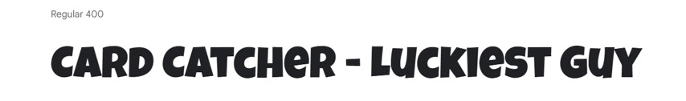
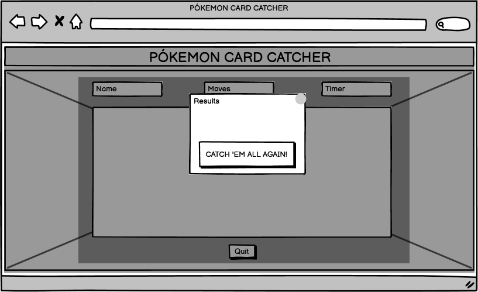

# Pokémon Card Catcher - Memory Card Game

Visit the deployed site: [Pókemon Card Catcher](https://izabellalopes.github.io/pokemon-card-catcher/)

Welcome to Pokémon Card Catcher, the ultimate memory card game that will put your memory skills to the test! Whether you're a seasoned Pokémon fan or just looking for a fun and challenging game, this is the perfect choice for you.

Pokémon Card Catcher was developed for players of all ages who enjoy testing their memory and concentration abilities while immersed in the colorful world of Pokémon. The game's concept is simple but addictive: find matching pairs of Pokémon cards as quickly as possible.

The game board features a grid of facedown cards, and your task is to flip them over two at a time, aiming to reveal cards with identical Pokémon. As you uncover the cards, try to remember their positions to make successful matches.

One unique aspect of Pokémon Card Catcher is that the captivating images of the Pokémon were drawn by my talented children. Their artwork adds a personal touch to the game, making it even more special and enjoyable for players of all ages.

Embark on this delightful Pokémon memory adventure and see if you have what it takes to catch 'em all in Pokémon Card Catcher!

## CONTENTS

- [User Experience](#user-experience-ux)

  - [User Stories](#user-stories)

- [Design](#design)

  - [Color Scheme](#color-scheme)
  - [Typography](#typography)
  - [Imagery](#imagery)
  - [Wireframes](#wireframes)
  - [Features](#features)
    - [The Home Page](#the-home-page)
    - [The Game Page](#the-game-page)
    - [The 404 Error Page](#the-404-error-page)
    - [Future Implementations](#future-implementations)
  - [Accessibility](#accessibility)

- [Technologies Used](#technologies-used)

  - [Languages Used](#languages-used)
  - [Frameworks, Libraries & Programs Used](#frameworks-libraries--programs-used)

- [Deployment & Local Development](#deployment--local-development)

  - [Deployment](#deployment)
  - [Local Development](#local-development)
    - [How to Fork](#how-to-fork)
    - [How to Clone](#how-to-clone)

- [Testing](#testing)
  - [Solved Bugs](#solved-bugs)
  - [Known Bugs](#known-bugs)
  - [Validator Testing](#validator-testing)
  - [Lighthouse](#lighthouse)
  - [Full Testing](#full-testing)
- [Credits](#credits)
  - [Code Used](#code-used)
  - [Content](#content)
  - [Media](#media)
  - [Acknowledgments](#acknowledgments)

---

## User Experience (UX)

### User Stories

#### First Time Visitor Goals

- I want to take part in an online memory card game. I want to be able to play at any time, anywhere.
- I want the site to be responsive to my device.
- I want the website to be easy to use, and it should allow me to explore, discover, and enjoy playing the "Pókemon Card Catcher" game without any difficulty.

#### Returning Visitor Goals

- I want to have the option to select a level of difficulty that suits me best, depending on my experience from the first time I visit the site.

#### Frequent Visitor Goals

- I wish to be able to adjust the difficulty level to make the game more enjoyable.
- I want to have the opportunity to view all the Pokémon images.

---

## Design

### Color Scheme

The color palette for the creation of the memory game "Pokémon Card Catcher" was carefully chosen to enhance the overall gaming experience and evoke a sense of nostalgia and excitement.

In my CSS file, I employed variables to define colors and consistently applied them across the entire stylesheet. It enables easy color updates throughout the website by modifying the color once in the variable, maintaining consistency across the design.

The following color codes were selected:

- Blue (#3466AF) and Yellow (#FFCB05) for Card Catcher header to match the Pokémon logo.

- As the site features a Pokémon landscape background image, I included a calming and soothing hue of Aliceblue (#F0F8FF) for a visually appealing backdrop, reducing eye strain during extended play. For the foreground color, I opted for a darker blue (#1E3B66) that provides excellent contrast, confirmed through the WebAIM Contrast Checker.

- Additionally, for icons and certain details, I selected shades of red, Firebrick (#B22222) and Dark Red (#64201C), reminiscent of the Pokéball, adding an element of excitement and intensity to the game.

The color palette was created using the [Coolors](https://coolors.co/) website.

### Typography

Google Fonts was used for the following fonts:

- [Luckiest Guy](https://fonts.google.com/specimen/Luckiest+Guy?preview.text=P%C3%B3kemon%20Card%20Catcher&preview.text_type=custom&query=Luckiest+Guy) for Header:

  - Cursive font
  - Reminiscent of the Pokémon logo, evoking a sense of nostalgia and familiarity

  

- [Fredoka](https://fonts.google.com/specimen/Fredoka?preview.text=P%C3%B3kemon%20Card%20Catcher&preview.text_type=custom&query=fredoka) for Body:
  - Sans-serif font
  - Clean and elegant design, that provides pleasant reading experience
  - Friendly and rounded letterforms complement the playful nature of the game, creating a visually appealing and enjoyable experience for the players

### Imagery

The images were sourced from free downloads from PngEgg, PngWing, Wallpaper Safari, Imgur, Flaticon, as well as personally handcrafted by my talented children, Thiago Carvalho, 7 years old, and Júlia Carvalho, 6 years old. To honor the sources of these remarkable images, proper credits have been given in the dedicated [credits](#Credits) section.

### Wireframes

I used Balsamiq to create the website's wireframe.

### Features

The website consists of a home page, a game page, as well as 404 and 500 error pages.

#### Existing Features

Every page on the website is responsive and includes:

- A favicon displayed in the browser tab.

- A header, featuring the Pokémon logo and the title 'Card Catcher,' which is situated at the top of every page.

#### The Home page

The home page features the following elements:

- A smooth background image, with colors that complement the chosen color palette for the game, reminiscent of scenes from the Pokémon game.

- An area for the player to enter their name and personalize the game.

- A play button with the text "Catch 'em all!", which is initially disabled. Once the player enters more than 3 characters, the "Catch 'em all!" button becomes active, changes color, displaying a background filled with Pokémon characters, and adds a zoom animation.

- A "How to Play" section, displaying the game's rules.

Level of difficulty modal:

- After the player enters their name and clicks on the "Catch 'em all!" button, they will be redirected to a modal with the title "Choose your level of difficulty": Easy, Medium, or Hard.

- Progressive pokéball icons have been added in front of the text to grab the player's attention.

- When hovering over them, there is a zoom animation and color change effect.

- Additionally, there is a FontAwesome "x" icon in the top right corner, which allows the player to exit the modal and return to the initial screen.

#### The Game page

#### The 404 Error Page

#### The 500 Error Page

#### Future Implementations

### Accessibility

I have been attentive to make the website as accessible-friendly as possible through the following measures:

- Utilizing semantic HTML to provide meaningful structure and enhance accessibility.
- Incorporating descriptive alt attributes for images on the site to provide alternative text for screen readers.
- Ensuring an adequate color contrast across the site to improve readability for users with visual impairments. I employed the contrast checker provided by [WebAIM](https://webaim.org/resources/contrastchecker/) to validate the contrast ratio between the selected foreground color and background color.

By implementing these considerations, I have strived to enhance the overall accessibility of the website.

---

## Technologies Used

### Languages Used

HTML, CSS, Javascript

### Frameworks, Libraries & Programs Used

* [Balsamiq](https://balsamiq.com/) - To create wireframes.

- [Codeanywhere](https://app.codeanywhere.com/) - IDE used to create the site.

- [Github](https://github.com/) - To save and store the files for the website.

- [Google Fonts](https://fonts.google.com/) - To import the fonts used on the website.

- [Google Developer Tools](https://developers.google.com/web/tools) - To troubleshoot and test features, resolve issues related to responsiveness and styling.

- [TinyPNG](https://tinypng.com/) To compress images

- [Safeimagekit](https://safeimagekit.com/) To resize images and convert them to the webp format.

- [Ezgif](https://ezgif.com/video-to-gif/) To convert video to gif to include in the Readme.md.

- [Font Awesome](https://fontawesome.com/) - For the iconography on the website.

- [Favicon.io](https://favicon.io/) To create favicon.

- [Am I Responsive?](http://ami.responsivedesign.is/) To display the website image across various devices.

- [Web Disability Simulator](https://chrome.google.com/webstore/detail/web-disability-simulator/olioanlbgbpmdlgjnnampnnlohigkjla) - A Google Chrome extension that allows you to view your site as people with accessibility needs would see it.

- [Webpage Spell-Check](https://chrome.google.com/webstore/detail/webpage-spell-check/mgdhaoimpabdhmacaclbbjddhngchjik/related) - a google chrome extension that allows you to spell check your webpage. Used to check the site and the readme for spelling errors.

---

## Deployment & Local Development

### Deployment

- The site was deployed using GitHub pages. The steps to deploy are as follows:
  1.  Login (or signup) to GitHub account.
  2.  Locate the repository named "" for this project.
  3.  Click on the "Settings" link.
  4.  In the left-hand side navigation bar, click on "Pages".
  5.  In the "Source" section, choose "main" from the branch selection dropdown menu. Select "Root" from the folder selection dropdown menu.
  6.  Click on "Save." Your GitHub Pages site is now deployed and can be accessed at the displayed URL.

The live link can be found here - 

### Local Development

#### How to Fork

To fork the repository:

1. Log in (or sign up) to Github.
2. Go to the repository for this project, 
3. Click the Fork button in the top right corner.

#### How to Clone

To clone the repository:

1. Log in (or sign up) to GitHub.
2. Go to the repository for this project, 
3. Click on the code button, select whether you would like to clone with HTTPS, SSH or GitHub CLI and copy the link shown.
4. Open the terminal in your code editor and change the current working directory to the location you want to use for the cloned directory.
5. Type 'git clone' into the terminal and then paste the link you copied in step 3. Press enter.

---

## Testing

Please refer to [TESTING.md](TESTING.md) file for all testing carried out.

### Solved Bugs

| Nº  | Bug | How I solved the issue |
| :-- | :-- | :--------------------- |
| 1   |

### Known Bugs

### Validator Testing

- HTML: No errors were returned when passing through the official W3C validator.

  -

- CSS: No errors were found when passing through the official Jigsaw validator.
  - [style.css](documentation/testing/w3c/w3c-css.png)

### Lighthouse

I utilized Lighthouse, a tool available in the Chrome Developer Tools, to assess the performance, accessibility, best practices, and SEO aspects of the website.

#### Home page

#### Game page

### Full Testing

To make sure my website works properly, I tested it on different web browsers like Google Chrome and Microsoft Edge, and also on different devices such as a Dell Inspiron 15-inch laptop and a Samsung A52S smartphone.

Additionally, I inspected each page using Google Chrome Developer Tools to ensure that they appeared correctly and were responsive on various screen sizes.

---

## Credits

### Code Used

- [LoveRunning source code from Code Institute](https://github.com/Code-Institute-Solutions/love-running-2.0-sourcecode)
- [README.md template from Code Institute](https://github.com/Code-Institute-Solutions/readme-template)
- [README.md examples from kera-cudmore](https://github.com/kera-cudmore/readme-examples/tree/main)

### Content

- Content for the website was written by Iza
  bella Lopes.
- The icons in the footer were taken from [Font Awesome](https://fontawesome.com/).

### Media

Header:

- [logo](https://www.pngegg.com/en/png-wpzwe) - Credit to PNG EGG.

Background:

- [bg](https://imgur.com/C90jsi5) - Credit to Imgur.

Play button:

- [play-button](https://wallpapersafari.com/w/CGzOkf) - Credit to wallpaper safari.

Pokemon icon:

- [pokeball](https://www.flaticon.com/free-icon/pokeball_361998?term=pokemon&page=1&position=7&origin=tag&related_id=361998) - Credit to Nikita Golubev - Flaticon.

Backface of memory cards:

- [back](https://www.pngegg.com/en/png-wgjie) - Credit to PNG EGG.

Frontface of memory cards:

- [ash](https://www.pngegg.com/en/png-bxlxe) - Credit to PNG EGG.
- [bulbasaur-julia](assets/images/bulbasaur-julia.webp) - Drawn by my daughter Júlia, 6 years old.
- [bulbasaur-thiago](assets/images/bulbasaur-thiago.webp) - Drawn by my son Thiago, 7 years old.
- [charizard-julia](assets/images/charizard-julia.webp) - Drawn by my daughter Júlia, 6 years old.
- [charizard-thiago](assets/images/charizard-thiago.webp) - Drawn by my son Thiago, 7 years old.
- [charmander-julia](assets/images/charmander-julia.webp) - Drawn by my daughter Júlia, 6 years old.
- [charmander-thiago](assets/images/charmander-thiago.webp) - Drawn by my son Thiago, 7 years old.
- [jigglypuff-thiago](assets/images/jigglypuff-thiago.webp) - Drawn by my son Thiago, 7 years old.
- [mew](https://www.pngegg.com/en/png-itrnm) - Credit to PNG EGG.
- [mewtwo](https://www.pngegg.com/en/png-icqhb) - Credit to PNG EGG.
- [oshawott](https://www.pngwing.com/en/free-png-pzfgn) - Credit to PNGWING.
- [pikachu-julia](assets/images/pikachu-julia.webp) - Drawn by my daughter Júlia, 6 years old.
- [pikachu-thiago](assets/images/pikachu-thiago.webp) - Drawn by my son Thiago, 7 years old.
- [piplup](https://www.pngegg.com/en/png-bbrqm) - Credit to PNG EGG.
- [squirtle-julia](assets/images/squirtle-julia.webp) - Drawn by my daughter Júlia, 6 years old.
- [wigglypuff-thiago](assets/images/wigglypuff-thiago.webp) - Drawn by my son Thiago, 7 years old.

### Acknowledgments

I would like to acknowledge the following individuals who helped me along the way in completing my second project:

- My family, for their strong support during my transition and development of a new career. Their names are featured in the testimonials and our team section of the CheckUp Dublin Center webpage as a way to honor them and show my appreciation.
- Jubril Akolade, my Code Institute Mentor, for providing valuable advice.
