# Pokémon Card Catcher - Memory Card Game

Visit the deployed site: [Pókemon Card Catcher](https://izabellalopes.github.io/pokemon-card-catcher/)

---

## CONTENTS

- [AUTOMATED TESTING](#automated-testing)
  - [W3C Validator](#w3c-validator)
  - [JavaScript Validator](#javascript-validator)
  - [Lighthouse](#lighthouse)
- [MANUAL TESTING](#manual-testing)
  - [Testing User Stories](#testing-user-stories)
  - [Full Testing](#full-testing)

Throughout the entire build, I conducted continuous testing. While working on the project, I relied on Chrome Developer Tools to precisely identify and address any issues that arose.

During the development process, I extensively utilized Google Developer Tools to verify the proper functioning of elements and to effectively troubleshoot when things didn't go as planned.

For JavaScript, I made use of the console in Developer Tools to carefully inspect small sections of code and ensure its smooth execution. Additionally, it proved invaluable in pinpointing and resolving any problems encountered.

To guarantee responsiveness across various screen sizes and devices, I meticulously checked each page using Google Chrome Developer Tools. This ensured a seamless user experience across all platforms.

---

## AUTOMATED TESTING

### W3C Validator

- HTML: No errors were returned when passing through the official [W3C validator](https://validator.w3.org/).

  - Home page 
  - Game page 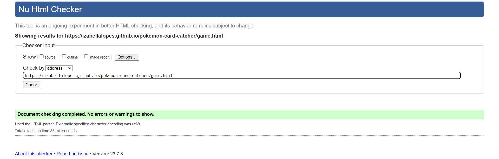
  - 404 Page 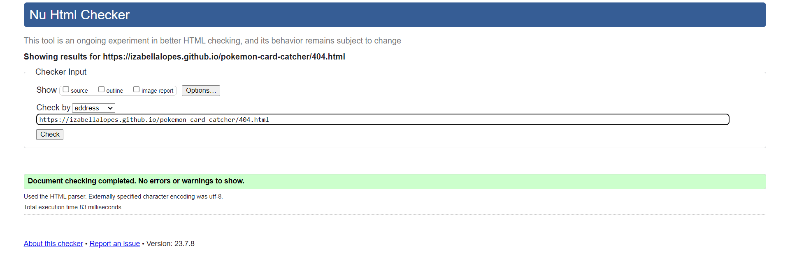

- CSS: No errors were found when passing through the official Jigsaw validator.

  - style.css 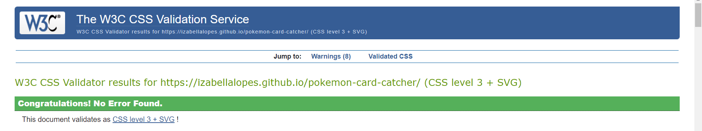

---

### JavaScript Validator

[jshint](https://jshint.com/) was used to validate the JavaScript.

- script.js 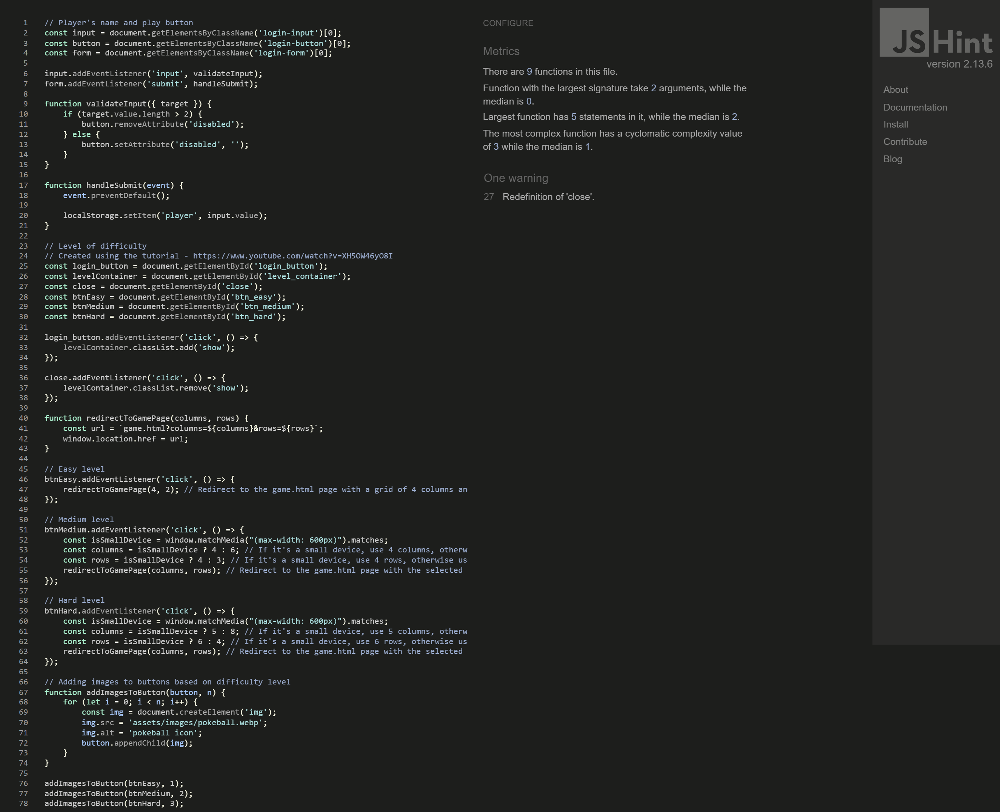
- game.js 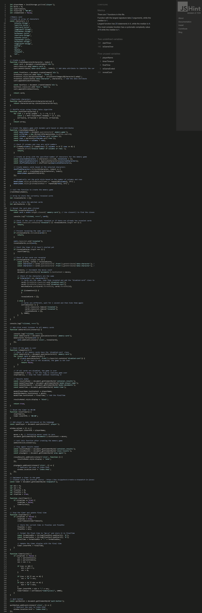

---

### Lighthouse

I utilized Lighthouse, a tool available in the Chrome Developer Tools, to assess the performance, accessibility, best practices, and SEO aspects of the website.

- Home page
  - Desktop 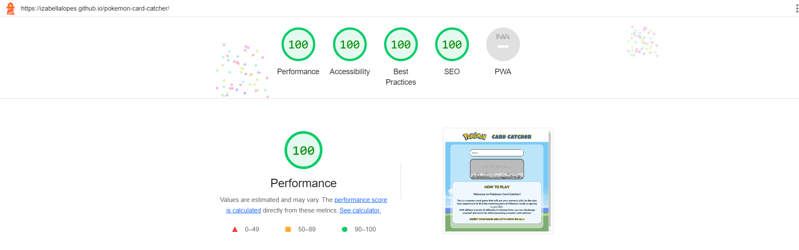
  - Mobile 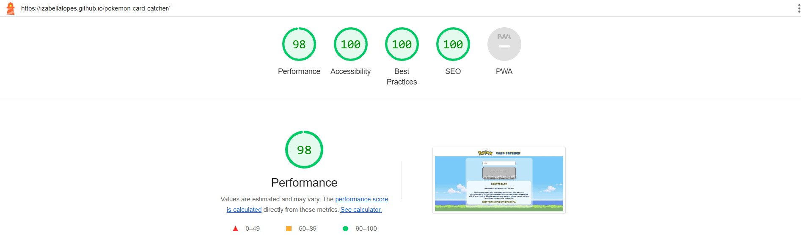
- Game page

  - Easy level

    - Desktop 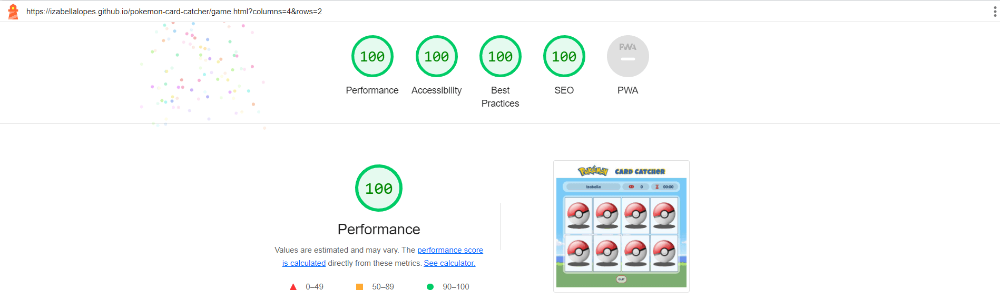
    - Mobile 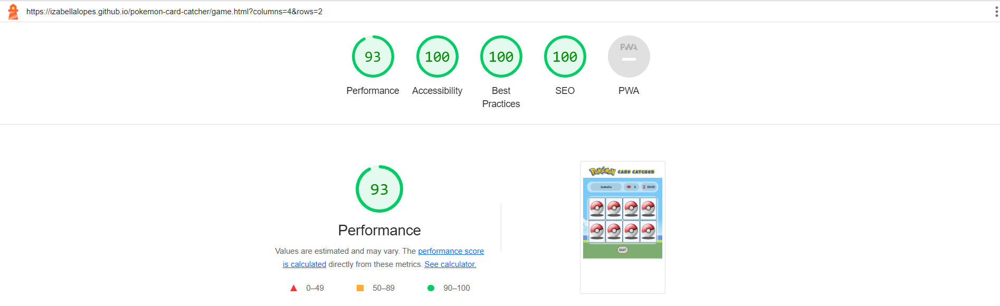

  - Medium level

    - Desktop 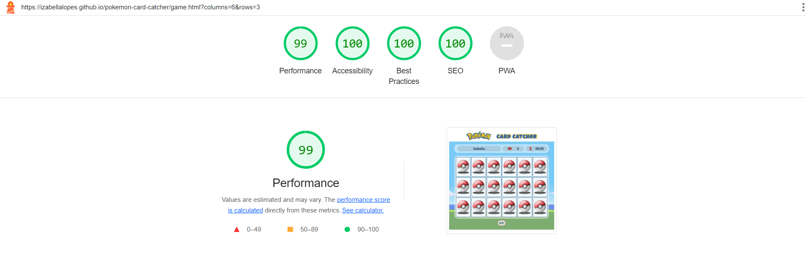
    - Mobile 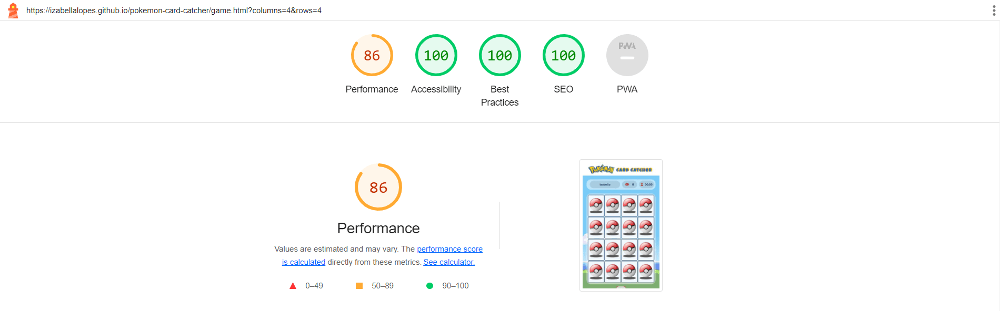

  - Hard level
    - Desktop 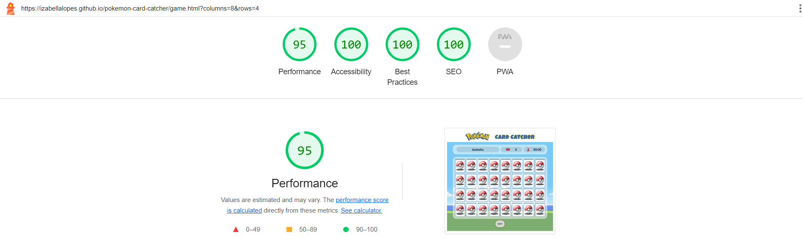
    - Mobile 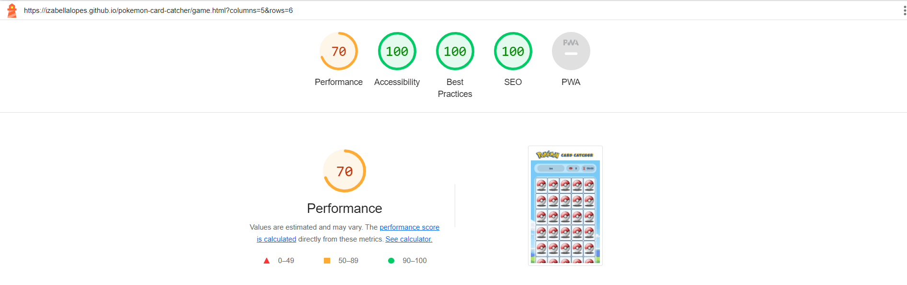

- 404 page
  - Desktop 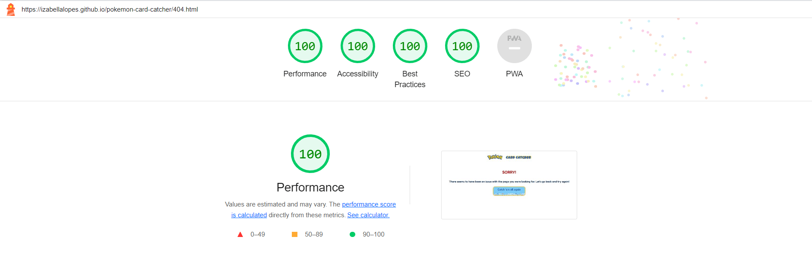
  - Mobile 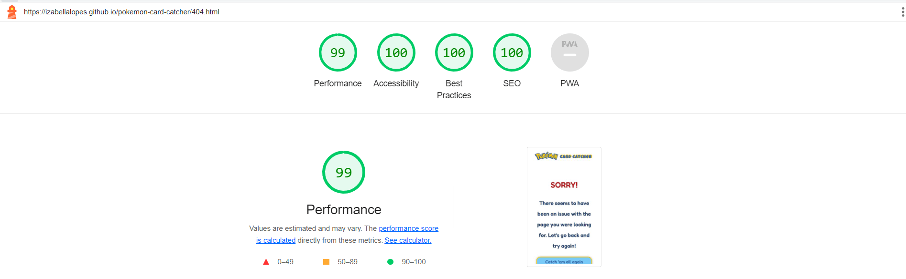

---

## MANUAL TESTING

### Testing User Stories

`First Time Visitors`

| Goals                                                                                                                                                        | How are they achieved?                                                                                                                                                                                                             |
| :----------------------------------------------------------------------------------------------------------------------------------------------------------- | :--------------------------------------------------------------------------------------------------------------------------------------------------------------------------------------------------------------------------------- |
| I want to take part in an online memory card game. I want to be able to play at any time, anywhere.                                                          | The website offers an engaging and interactive "Pókemon Card Catcher" game that allows users to test their memory skills by flipping and matching virtual cards. The site is available for use whenever is convenient to the user. |
| I want the site to be responsive to my device.                                                                                                               | The website's design is responsive, ensuring seamless gameplay and optimal user experience across various devices, including desktops, laptops, tablets, and smartphones.                                                          |
| I want the website to be easy to use, and it should allow me to explore, discover, and enjoy playing the "Pókemon Card Catcher" game without any difficulty. | The website boasts an intuitive and user-friendly interface, making it easy for first-time visitors to navigate, explore, and enjoy the game without encountering any complications or confusion.                                  |

`Returning Visitors`

| Goals                                                                                                                                          | How are they achieved?                                                                                                                            |
| :--------------------------------------------------------------------------------------------------------------------------------------------- | :------------------------------------------------------------------------------------------------------------------------------------------------ |
| I want to have the option to select a level of difficulty that suits me best, depending on my experience from the first time I visit the site. | Enable personalized user experience by implementing a selectable difficulty level, catering to individual preferences and past site interactions. |

`Frequent Visitors`

| Goals                                                                             | How are they achieved?                                                                                                                                              |
| :-------------------------------------------------------------------------------- | :------------------------------------------------------------------------------------------------------------------------------------------------------------------ |
| I wish to be able to adjust the difficulty level to make the game more enjoyable. | Enhance user engagement for frequent visitors with adjustable difficulty levels.                                                                                    |
| I want to have the opportunity to view all the Pokémon images.                    | In the hard level on desktop devices, all Pokémon cards are displayed, offering players the chance to unlock and view all Pokémon images through repeated gameplay. |

---

### Full Testing

To make sure my website works properly, I tested it on the following devices:

- Laptop:
  - Dell Inspiron 15-inch screen
- Mobile Devices:
  - Samsung A52S smartphone.
  - iPhone 11 pro.

Each device tested the site using the following browsers:

- Google Chrome
- Safari
- Firefox

Additionally, I inspected each page using Google Chrome Developer Tools to ensure that they appeared correctly and were responsive on various screen sizes.

Comprehensive testing was conducted by family and friends across various devices and screen sizes, and no issues were reported during gameplay.

`Home Page`

| Feature                                   | Expected Outcome                                                                                                                                                                                              | Testing Performed                                                                                                                                                                                                      | Result                                                                                                                                                                                                                                 | Pass/Fail |
| ----------------------------------------- | ------------------------------------------------------------------------------------------------------------------------------------------------------------------------------------------------------------- | ---------------------------------------------------------------------------------------------------------------------------------------------------------------------------------------------------------------------- | -------------------------------------------------------------------------------------------------------------------------------------------------------------------------------------------------------------------------------------- | --------- |
| Static Site Title                         | The site title remains fixed/static to emphasize the game items, and it is responsive across different devices                                                                                                | Clicking on the site title to ensure no action occurs, and testing the title's responsiveness on various devices                                                                                                       | The site title remains static as intended, and it behaves responsively across different devices, with no action occurring upon clicking                                                                                                | Pass      |
| Player Name Input Form                    | Players should be able to enter their names to start playing. The "Catch 'em all!" button should enable when the name exceeds 3 characters. Additionally, the button should change color on hover             | Tested inputting names of different lengths, checked button behavior when the name is longer than 3 characters, and verified button color change on hover                                                              | The form allows players to input their names for playing. The "Catch 'em all!" button properly enables/disables based on the name length, and it changes color as expected when hovered over                                           | Pass      |
| "Catch 'em all!" Button                   | The button enables when the player's name consists of more than 3 characters, as described above. When enabled, it exhibits a zoom hover effect and redirects to the "Level of Difficulty" modal when clicked | Checked button behavior with different name lengths (longer and shorter than 3 characters), verified zoom hover effect, and tested button click functionality to ensure redirection to the "Level of Difficulty" modal | The "Catch 'em all!" button properly enables when the player's name is longer than 3 characters, and it exhibits the expected zoom hover effect. When clicked, it successfully redirects the player to the "Level of Difficulty" modal | Pass      |
| Level of Difficulty Modal - Close Button  | When the "Close" button is clicked in the Level of Difficulty modal, it should return the user to the initial page                                                                                            | Clicked the "Close" button within the Level of Difficulty modal and observed the behavior                                                                                                                              | The "Close" button inside the Level of Difficulty modal functions as expected, returning the user to the initial page when clicked                                                                                                     | Pass      |
| Level of Difficulty Modal - Easy Button   | The "Easy" button inside the Level of Difficulty modal should display color change and zoom hover effects. When clicked, it should redirect the game to the "Easy" level                                      | Observed the hover effects on the "Easy" button, and clicked the button to ensure the game redirects to the "Easy" level                                                                                               | The "Easy" button inside the Level of Difficulty modal successfully exhibits color change and zoom hover effects. When clicked, it redirects the game to the "Easy" level as expected                                                  | Pass      |
| Level of Difficulty Modal - Medium Button | The "Medium" button inside the Level of Difficulty modal should display color change and zoom hover effects. When clicked, it should redirect the game to the "Medium" level                                  | Observed the hover effects on the "Medium" button, and clicked the button to ensure the game redirects to the "Medium" level                                                                                           | The "Medium" button inside the Level of Difficulty modal successfully exhibits color change and zoom hover effects. When clicked, it redirects the game to the "Medium" level as expected                                              | Pass      |
| Level of Difficulty Modal - Hard Button   | The "Hard" button inside the Level of Difficulty modal should display color change and zoom hover effects. When clicked, it should redirect the game to the "Hard" level                                      | Observed the hover effects on the "Hard" button, and clicked the button to ensure the game redirects to the "Hard" level                                                                                               | The "Hard" button inside the Level of Difficulty modal successfully exhibits color change and zoom hover effects. When clicked, it redirects the game to the "Hard" level as expected                                                  | Pass      |

`Game Page`

| Feature                                      | Expected Outcome                                                                                                                                                                                                                                                                                                                                                                                   | Testing Performed                                                                                                                                                                            | Result                                                                                                                                                                                                                                                 | Pass/Fail |
| -------------------------------------------- | -------------------------------------------------------------------------------------------------------------------------------------------------------------------------------------------------------------------------------------------------------------------------------------------------------------------------------------------------------------------------------------------------- | -------------------------------------------------------------------------------------------------------------------------------------------------------------------------------------------- | ------------------------------------------------------------------------------------------------------------------------------------------------------------------------------------------------------------------------------------------------------ | --------- |
| Static Site Title                            | The site title remains fixed/static to emphasize the game items, and it is responsive across different devices                                                                                                                                                                                                                                                                                     | Clicking on the site title to ensure no action occurs, and testing the title's responsiveness on various devices                                                                             | The site title remains static as intended, and it behaves responsively across different devices, with no action occurring upon clicking                                                                                                                | Pass      |
| Game Container                               | The Game container should display the player's name, movement count, and timer during gameplay                                                                                                                                                                                                                                                                                                     | Checked the Game container during gameplay to verify if it shows the player's name, movement count, and timer accurately                                                                     | The Game container functions as intended, showing the player's name, movement count, and timer during gameplay, providing relevant information to the player                                                                                           | Pass      |
| Player Info                                  | The player's name entered on the initial screen should appear in this field                                                                                                                                                                                                                                                                                                                        | Entered the player's name on the initial screen and verified if it is displayed correctly in the Player Info field                                                                           | The Player Info field successfully displays the player's name as expected, reflecting the name entered on the initial screen                                                                                                                           | Pass      |
| Player's Movement Count                      | The movement count should increase by one with each attempt to match pairs in the memory game                                                                                                                                                                                                                                                                                                      | Played the memory game, made multiple attempts to match pairs, and checked if the movement count increased correctly                                                                         | The Player's Movement Count functions as expected, incrementing by one with each attempt to match pairs in the memory game, accurately reflecting the player's moves                                                                                   | Pass      |
| Timer                                        | The timer starts counting from the moment the player initiates the memory game. When the game ends, the elapsed time is displayed and paused on the screen                                                                                                                                                                                                                                         | Started the memory game and noted the timer's behavior during gameplay. Verified if the elapsed time was correctly displayed and paused at the end of the game                               | The Timer feature operates as intended, accurately counting the time elapsed from the start of the memory game. At the game's completion, the timer displays and pauses the elapsed time on the screen                                                 | Pass      |
| Memory Game Grid - Easy Level                | When the player selects the "Easy" level, the memory game grid should display 4 columns and 2 rows, both above and below a 600px wide screen                                                                                                                                                                                                                                                       | Checked the memory game grid on different screen sizes (above and below 600px) after selecting the "Easy" level to ensure it shows 4 columns and 2 rows                                      | The Memory Game Grid for the "Easy" level behaves as expected, showing 4 columns and 2 rows on screens both above and below 600px wide, providing an appropriate layout for gameplay                                                                   | Pass      |
| Memory Game Grid - Medium Level              | On small devices, the grid should display 4 columns and 4 rows. Above 600px wide screens, it should show 6 columns and 3 rows                                                                                                                                                                                                                                                                      | Tested the memory game grid on both small devices and screens above 600px wide to verify if it shows 4 columns and 4 rows for small devices and 6 columns and 3 rows for screens above 600px | The Memory Game Grid for the "Medium" level functions correctly, displaying 4 columns and 4 rows on Small devices and 6 columns and 3 rows on screens above 600px wide, providing appropriate layouts for the respective devices                       | Pass      |
| Memory Game Grid - Hard Level                | On small devices, the grid should have 5 columns and 6 rows. Above 600px wide screens, it should display 8 columns and 4 rows                                                                                                                                                                                                                                                                      | Verified the memory game grid on both small devices and screens above 600px wide to ensure it shows 5 columns and 6 rows for small devices and 8 columns and 4 rows for screens above 600px  | The Memory Game Grid for the "Hard" level performs as expected, showing 5 columns and 6 rows on small devices and 8 columns and 4 rows on screens above 600px wide, providing suitable layouts for each type of device                                 | Pass      |
| Memory Cards                                 | The game should start with all cards showing the backface with the image of a Pokéball. When the player clicks on a card, it should flip 180 degrees and display the frontface with various Pokémon-themed characters. If two cards match, they will turn gray with a transitional effect and remain visible. If the images don't match, they will flip back 180 degrees to their initial position | Clicked on different cards to verify their flip animation, matched cards to check the transitional effect, and tested unmatched cards to ensure they flip back to the initial position       | The Memory Cards feature functions as expected, providing the described behavior during gameplay. The cards flip on click, match with a transitional effect when the images match, and flip back when they don't, enhancing the memory game experience | Pass      |
| Quit Button                                  | When the Quit button is clicked, the player should be redirected to the initial page                                                                                                                                                                                                                                                                                                               | Clicked the Quit button during gameplay to verify if it returns the player to the initial page                                                                                               | The Quit button functions as expected, redirecting the player to the initial page when clicked, allowing them to easily exit the game                                                                                                                  | Pass      |
| Results Modal                                | The Results Modal should automatically appear after the game ends, displaying a message to the player showing the number of moves and the time spent during the match                                                                                                                                                                                                                              | Completed the game and observed if the Results Modal appeared, checked if it displayed the correct number of moves and the timer value                                                       | The Results Modal performs as expected, showing up automatically after the game ends and presenting a message to the player with the accurate number of moves and the time spent during the gameplay                                                   | Pass      |
| Results Modal - Close Button                 | When the "Close" button is clicked in the Results modal, it should return the user to the game page                                                                                                                                                                                                                                                                                                | Clicked the "Close" button within the Results modal and observed the behavior                                                                                                                | The "Close" button inside the Results modal functions as expected, returning the user to the game page when clicked                                                                                                                                    | Pass      |
| Results Modal - "Catch 'em all again" Button | When the "Catch 'em all again" button is clicked, the player should be redirected to the initial page to start a new game                                                                                                                                                                                                                                                                          | Clicked the "Catch 'em all again" button on the Results Modal to verify if it redirects the player to the initial page for a new game                                                        | The "Catch 'em all again" button inside the Results Modal functions as intended, redirecting the player to the initial page when clicked, allowing them to start a new game easily                                                                     | Pass      |

`404 Error Page`

| Feature                      | Expected Outcome                                                                                                                                           | Testing Performed                                                                                                       | Result                                                                                                                                                                                                         | Pass/Fail |
| ---------------------------- | ---------------------------------------------------------------------------------------------------------------------------------------------------------- | ----------------------------------------------------------------------------------------------------------------------- | -------------------------------------------------------------------------------------------------------------------------------------------------------------------------------------------------------------- | --------- |
| Static Site Title            | The site title remains fixed/static to emphasize the game items, and it is responsive across different devices                                             | Clicking on the site title to ensure no action occurs, and testing the title's responsiveness on various devices        | The site title remains static as intended, and it behaves responsively across different devices, with no action occurring upon clicking                                                                        | Pass      |
| 404 Error Page Message       | The message "There seems to have been an issue with the page you were looking for. Let's go back and try again!" should be displayed on the 404 error page | Accessing a non-existent page to trigger the 404 error and checking if the error page displays the expected message     | The 404 error page shows the message "There seems to have been an issue with the page you were looking for. Let's go back and try again!" as intended, providing user-friendly guidance for handling the error | Pass      |
| "Catch 'em all again" Button | When the "Catch 'em all again" button is clicked, the player should be redirected to the initial page                                                      | Clicked the "Catch 'em all again" button on the 404 Error Page to verify if it redirects the player to the initial page | The "Catch 'em all again" button inside the 404 Error Page functions as intended, redirecting the player to the initial page when clicked, allowing them to start a new game easily                            | Pass      |
