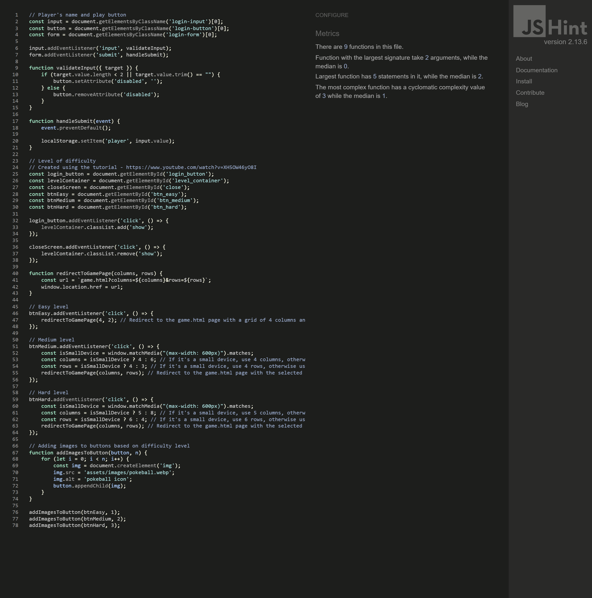

# Pokémon Card Catcher - Memory Card Game

Visit the deployed site: [Pókemon Card Catcher](https://izabellalopes.github.io/pokemon-card-catcher/)

---

## CONTENTS

- [AUTOMATED TESTING](#automated-testing)
  - [W3C Validator](#w3c-validator)
  - [JavaScript Validator](#javascript-validator)
  - [Lighthouse](#lighthouse)
- [MANUAL TESTING](#manual-testing)
  - [Testing User Stories](#testing-user-stories)
  - [Full Testing](#full-testing)

Throughout the entire build, I conducted continuous testing. While working on the project, I relied on Chrome Developer Tools to precisely identify and address any issues that arose.

During the development process, I extensively utilized Google Developer Tools to verify the proper functioning of elements and to effectively troubleshoot when things didn't go as planned.

For JavaScript, I made use of the console in Developer Tools to carefully inspect small sections of code and ensure its smooth execution. Additionally, it proved invaluable in pinpointing and resolving any problems encountered.

To guarantee responsiveness across various screen sizes and devices, I meticulously checked each page using Google Chrome Developer Tools. This ensured a seamless user experience across all platforms.

---

## AUTOMATED TESTING

### W3C Validator

- HTML: No errors were returned when passing through the official [W3C validator](https://validator.w3.org/).

  - Home page 
  - Game page 
  - 404 Page 

- CSS: No errors were found when passing through the official Jigsaw validator.

  - style.css 

---

### JavaScript Validator

[jshint](https://jshint.com/) was used to validate the JavaScript.

- script.js 
- game.js 

---

### Lighthouse

I utilized Lighthouse, a tool available in the Chrome Developer Tools, to assess the performance, accessibility, best practices, and SEO aspects of the website.

- Home page
  - Desktop 
  - Mobile 
- Game page

  - Easy level

    - Desktop 
    - Mobile 

  - Medium level

    - Desktop 
    - Mobile 

  - Hard level
    - Desktop 
    - Mobile 

- 404 page
  - Desktop 
  - Mobile 

---
